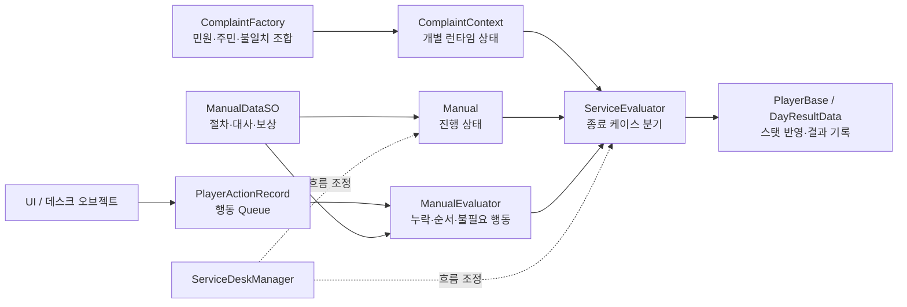

# 퇴근하고 싶다 (GetOffWork)

> 정해진 매뉴얼을 따라 민원을 처리하고, 시간·정확도·스트레스를 관리해 무사히 퇴근하는 데이터 기반 데스크 시뮬레이션입니다.

[플레이 영상](https://youtu.be/6e-tjQ2U7VE) · [상세 기술 기록](https://app.notion.com/p/3cef1fce5d1681eb940ac37e5e0dce11) · [포트폴리오](https://hwang-doyeon-game-dev.hwangdy135.chatgpt.site)

<table>
  <tr>
    <td></td>
    <td></td>
  </tr>
  <tr>
    <td align="center">하루 업무 시작</td>
    <td align="center">민원인 응대</td>
  </tr>
  <tr>
    <td></td>
    <td></td>
  </tr>
  <tr>
    <td align="center">주민 정보 조회와 서류 처리</td>
    <td align="center">점심 선택과 스탯 관리</td>
  </tr>
</table>

## 프로젝트 개요

| 항목 | 내용 |
|---|---|
| 개발 기간 | 2026.03.04–2026.04.30 · 약 8주 |
| 개발 형태 | 1인 개발 · 시스템 기획, 데이터 설계, 클라이언트 구현 전반 |
| 장르 / 플랫폼 | 매뉴얼 기반 포인트 앤 클릭 데스크 시뮬레이션 / PC |
| 엔진 / 언어 | Unity 6000.3.9f1 / C# |
| 현재 상태 | 개발 종료 · 출시 예정 없음 |

### 기여 범위와 AI 활용

개인 프로젝트로 게임 규칙, 데이터 구조, 화면 흐름, 클래스 책임, Unity 적용과 콘텐츠 조립, 플레이 검증 및 리팩터링 방향을 직접 결정했습니다.

Claude Code는 C# 코드 초안과 수정안을 만드는 보조 도구로 사용했습니다. 생성 결과를 그대로 성과로 간주하지 않고 Unity에서 직접 동작을 확인했으며, 실제 판정 결과를 기획 규칙과 대조해 오류 지점을 찾고 수정 방향을 결정했습니다. 아래 수치는 저장소 결과물의 범위를 뜻하며, 모든 코드 라인을 수기로 작성했다는 의미는 아닙니다.

## 핵심 플레이 흐름

**출근 준비 → 오전 근무 → 점심 선택 → 오후 근무 → 퇴근 결과지**

1. 민원인을 호출하고 요청 유형과 신분증을 확인합니다.
2. 전산에서 주민 정보를 조회해 불일치 여부를 판단합니다.
3. 질문·인쇄·모바일 전송·주소 변경 등 요청별 절차를 수행합니다.
4. 신분증과 서류를 올바르게 반환하고 응대를 종료합니다.
5. 하루가 끝나면 성공·실패·점심·아이템·마감 취소가 만든 스탯 변화를 확인합니다.

## 시스템 구조



`ServiceDeskManager`는 응대 흐름을 조정하고, 데이터 생성은 `ComplaintFactory`, 규칙 평가는 `ManualEvaluator`, 종료 정산은 `ServiceEvaluator`가 맡도록 책임을 나눴습니다.

## 구현 포인트

### 1. Queue와 List를 이용한 절차 판정

기획자가 `ManualDataSO.steps`에 조립한 필수 절차 List와 플레이 중 쌓인 행동 Queue를 비교합니다.

- 필수 절차마다 서로 다른 Queue 항목을 1:1로 매핑합니다.
- 같은 `commandId`가 여러 번 필요하면 `HashSet`으로 이미 소비한 인덱스를 제외합니다.
- 미매핑은 누락, `IsOrdered` 단계의 역전은 순서 위반으로 판정합니다.
- 매뉴얼에 없거나 허용 횟수를 넘긴 행동은 불필요 행동으로 집계합니다.
- 판정 결과와 보상·패널티 데이터를 분리해 수치 조정이 판정 코드를 바꾸지 않도록 했습니다.

근거: [`ManualEvaluator`](https://github.com/doyeon-SM/GetOffWork/blob/main/Assets/_Base/0_Scripts/Manual/ManualEvaluator.cs#L43-L223) · [`PlayerActionRecord`](https://github.com/doyeon-SM/GetOffWork/blob/main/Assets/_Base/0_Scripts/Manual/PlayerActionRecord.cs#L3-L25) · [`ManualDataSO`](https://github.com/doyeon-SM/GetOffWork/blob/main/Assets/_Base/0_Scripts/Manual/ManualDataSO.cs#L18-L52)

### 2. 정상적인 반려가 감점되는 규칙 오류 해결

**현상**

위조 신분증을 발견해 정상적으로 반려하면 인쇄·전송 같은 후속 절차를 실행하지 않습니다. 초기 판정은 이 행동들을 모두 누락으로 계산해 올바른 판단에도 패널티를 부여했습니다.

**원인**

일반 완료와 정상 반려가 같은 절차 평가 경로를 공유해, “더 진행하면 안 되는 상황”을 구분하지 못했습니다.

**해결**

응대 종료 전에 불일치·반려·완료 상태를 조합해 케이스를 먼저 분기했습니다. 정상 반려는 절차 평가를 건너뛰고 완료 보상을 적용하며, 불일치를 놓친 완료와 불일치 없는 반려는 실패로 처리했습니다. 주소 변경 확정 뒤 반려하는 시점 의존 예외도 별도로 막았습니다.

**검증**

정상 반려, 반려사항 놓침, 불일치 없는 반려, 주소 변경 확정 뒤 반려를 직접 플레이하고 최종 판정과 스탯 변화가 규칙표와 일치하는지 확인했습니다.

근거: [`ServiceEvaluator` 진입 분기](https://github.com/doyeon-SM/GetOffWork/blob/main/Assets/_Base/0_Scripts/Game/ServiceEvaluator.cs#L18-L50) · [`정상 반려 처리`](https://github.com/doyeon-SM/GetOffWork/blob/main/Assets/_Base/0_Scripts/Game/ServiceEvaluator.cs#L90-L147) · [`일반 평가와 보상`](https://github.com/doyeon-SM/GetOffWork/blob/main/Assets/_Base/0_Scripts/Game/ServiceEvaluator.cs#L182-L249)

### 3. ScriptableObject 런타임 상태 오염 제거

**현상**

대기열에 여러 민원인이 쌓이면 신분증 표시 정보가 서로 뒤섞였습니다.

**원인**

여러 인스턴스가 공유하는 주민 `ScriptableObject`에 위조 여부와 표시값을 런타임 중 기록했습니다.

**해결**

ScriptableObject는 읽기 전용 정의로 두고, 민원인별 불일치·입력·진행 상태는 `ComplaintContext`가 소유하도록 변경했습니다. 신분증 표시값은 오브젝트 생성 시점에 원본 데이터와 Context 플래그를 조합해 전달합니다.

근거: [`ComplaintFactory`의 불일치 상태 생성](https://github.com/doyeon-SM/GetOffWork/blob/main/Assets/_Base/0_Scripts/Game/ComplaintFactory.cs#L149-L187) · [`ComplaintContext`](https://github.com/doyeon-SM/GetOffWork/blob/main/Assets/_Base/0_Scripts/Manual/ComplaintContext.cs#L19-L119) · [`ObjectManagerBox` 표시값 계산](https://github.com/doyeon-SM/GetOffWork/blob/main/Assets/_Base/0_Scripts/Manual/Object/ObjectManagerBox.cs#L205-L217)

## 저장소에서 확인한 구현 범위

기준: 기본 브랜치 `HEAD` (`77b49a8`)

| 항목 | 확인 결과 |
|---|---:|
| 커밋 / 작성자 | 117 commits / 단독 커미터 |
| C# 스크립트 | 113개 |
| 게임 데이터 ScriptableObject | 110개 |
| 프리팹 | 34개 |
| 활성 플레이 씬 | 4개 · Title → Home → Main → Ending |
| 매뉴얼 데이터 | 민원 정의 6개 · 절차 정의 19개 · 절차 대사 7개 |
| 튜토리얼 데이터 | Flow 4개 · Step 18개 |
| 콘텐츠 데이터 | 주민 레코드 21개 · 편의점 아이템 9개 · 점심 옵션 14개 |

게임 데이터 110개는 `Manual` 60개, `UserData` 26개, `ItemData` 10개, `LunchData` 14개를 합산한 값입니다. 편의점 아이템 9개는 `ItemData`의 관리용 에셋 1개를 제외한 수치입니다.

## 실행 방법

```bash
git clone https://github.com/doyeon-SM/GetOffWork.git
```

1. Unity Hub에서 저장소 루트를 프로젝트로 추가합니다.
2. 저장소의 [`ProjectVersion.txt`](https://github.com/doyeon-SM/GetOffWork/blob/main/ProjectSettings/ProjectVersion.txt)에 맞춰 **Unity 6000.3.9f1**로 엽니다.
3. [`Assets/_Base/2_Scenes/0_TitleScene.unity`](https://github.com/doyeon-SM/GetOffWork/blob/main/Assets/_Base/2_Scenes/0_TitleScene.unity)을 열고 Play를 실행합니다.

진입 씬과 4개 활성 씬은 [`EditorBuildSettings.asset`](https://github.com/doyeon-SM/GetOffWork/blob/main/ProjectSettings/EditorBuildSettings.asset#L7-L22)에서 확인할 수 있습니다. 저장소에는 소스와 Unity 에셋이 포함되어 있으며 별도 배포 실행 파일은 제공하지 않습니다.

## 한계와 회고

- 자동화 테스트가 없어 민원 유형이 늘수록 수동 회귀 테스트 비용이 커졌습니다. 다음 단계에서는 행동 Queue와 예상 스탯 델타를 입력으로 하는 판정기 단위 테스트가 우선입니다.
- 커밋 메시지가 날짜 중심이라 변경 이유를 이력만으로 복원하기 어렵습니다. 이후에는 문제·의도·변경 결과가 드러나는 단위로 기록할 필요가 있습니다.
- 출시를 목표로 한 제품이 아니라 8주 동안 핵심 규칙과 완결된 하루 흐름을 구현한 개인 프로젝트입니다.
- 이 프로젝트를 통해 **공유 에셋은 정의, Context는 런타임 상태**라는 데이터 소유권 원칙을 실제 오류 해결로 정립했습니다.
